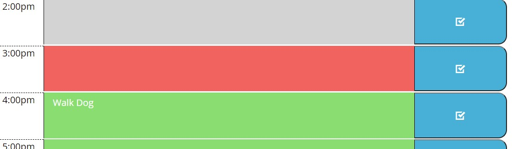

# Work Day Scheduler 

## Description
This is a calendar you can use daily to track tasks that you must complete throughout the day.

## Calendar
You are able to add and edit tasks for each hour throughout the day. The header will also tell you the current date here:

You will also notice that this calendar highlights tasks that have past in grey, that are occuring in the current hour in red, and the future in green. This will help you identify the priority tasks.

## Built With
This website uses the following:
* HTML
* CSS
* Javascript (using Bootstrap, JQuery, fontawesome, googleapis, and cloudflare)

Visit the live site here: https://meggedde.github.io/Challenge5/
